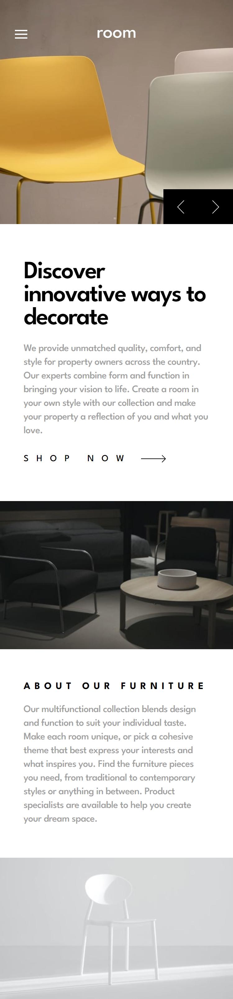

# Frontend Mentor - Room homepage solution

This is a solution to the [Room homepage challenge on Frontend Mentor](https://www.frontendmentor.io/challenges/room-homepage-BtdBY_ENq). Frontend Mentor challenges help you improve your coding skills by building realistic projects. 

### The challenge

Users should be able to:

- View the optimal layout for the site depending on their device's screen size
- See hover states for all interactive elements on the page
- Navigate the slider using either their mouse/trackpad or keyboard

### Screenshot

 It is my pleasure to share with you a screenshot of my solution to the room-homepage challenge. In developing this solution, my primary goal was to create a visually stunning interface that showcases the beauty and elegance of the featured rooms. Users can easily navigate through the different rooms, with each room being displayed in a visually appealing layout that provides detailed information such as room size, amenities, and pricing. I have also incorporated elements such as high-quality images and animations to further enhance the overall user experience. I believe that my solution represents a significant improvement over traditional room homepage designs and I look forward to hearing your thoughts and feedback.

### Links

- Live Site URL: [room-homepage](https://room-homepage-one-jet.vercel.app/)

### Built with

- Semantic HTML5 markup
- CSS custom properties
- SASS/SCSS
- Vanilla Javascript

## Author

- Website - [Jownsu](https://jownsu.github.io/)
- Frontend Mentor - [@jownsu](https://www.frontendmentor.io/profile/jownsu)
- Instagram - [jownsu](https://www.instagram.com/jownsu/)
- Linked In - [Jhones](https://www.linkedin.com/in/jhones-digno-866904213/)